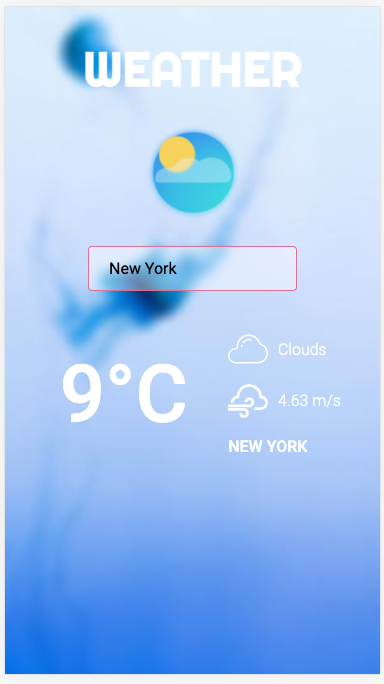

# Weather-app

Made with

- `React, React Router, styled-components, ESLint, Lottie, OpenWeather`
- `node.js, express, dotenv, cors, nodemon, node-fetch`

# Install

1. copy repository to your local enviroment
2. run `npm install`
3. add your API Key to the `.env.example` and rename it to `.env`
   (get API Key here https://openweathermap.org/api)
4. run `npm run dev`
